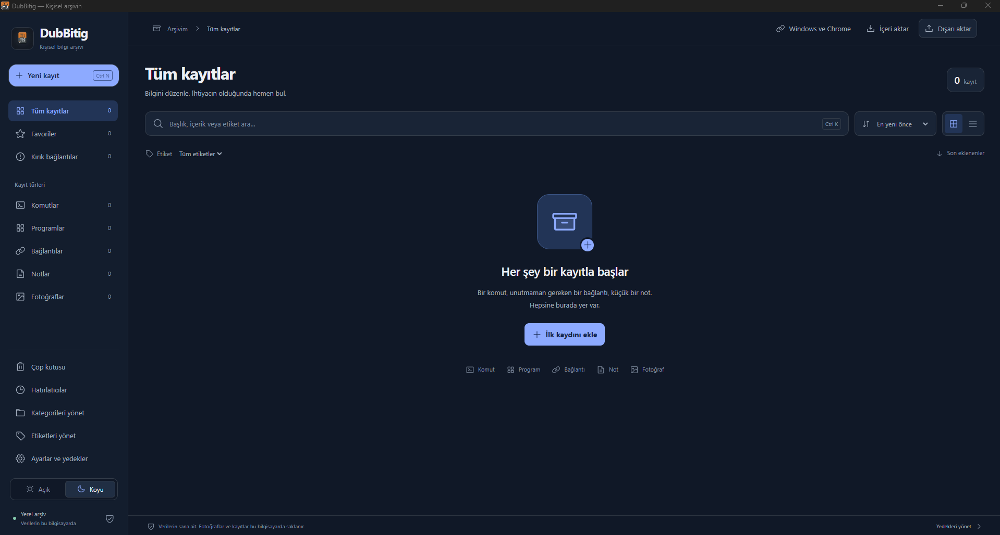
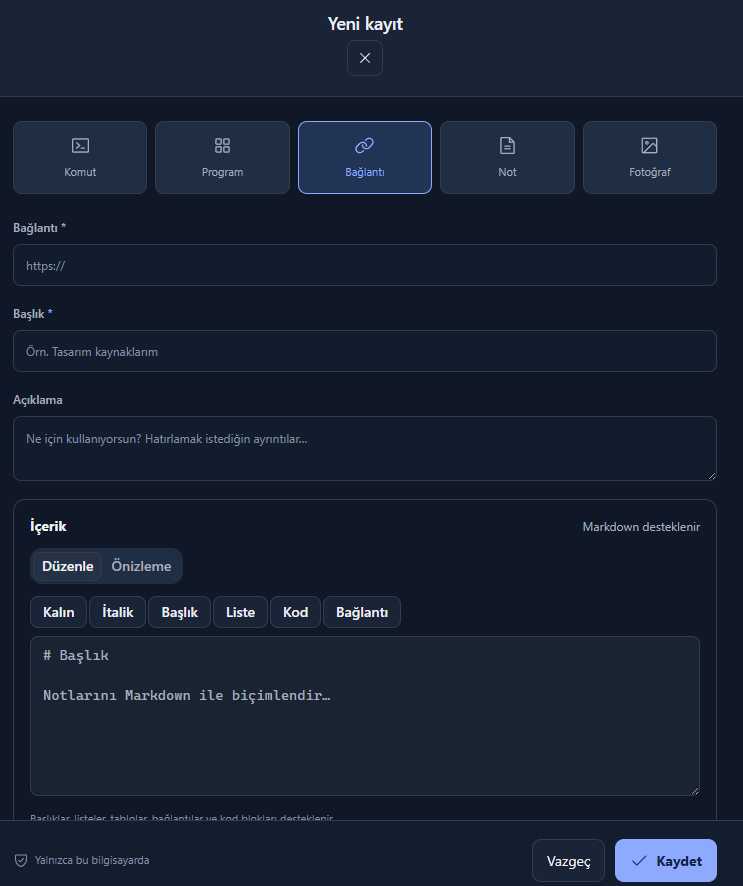
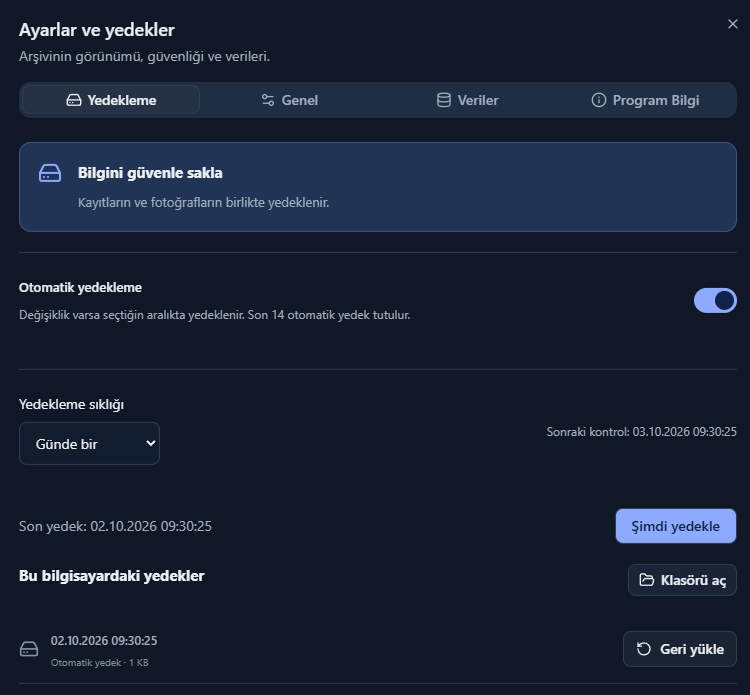
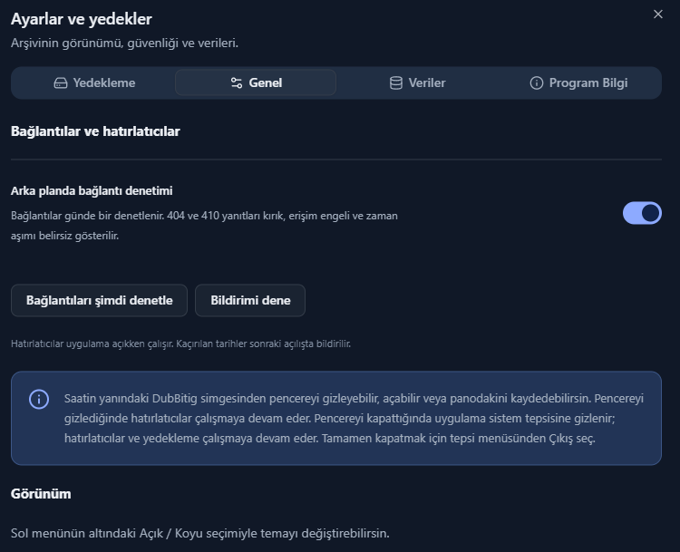
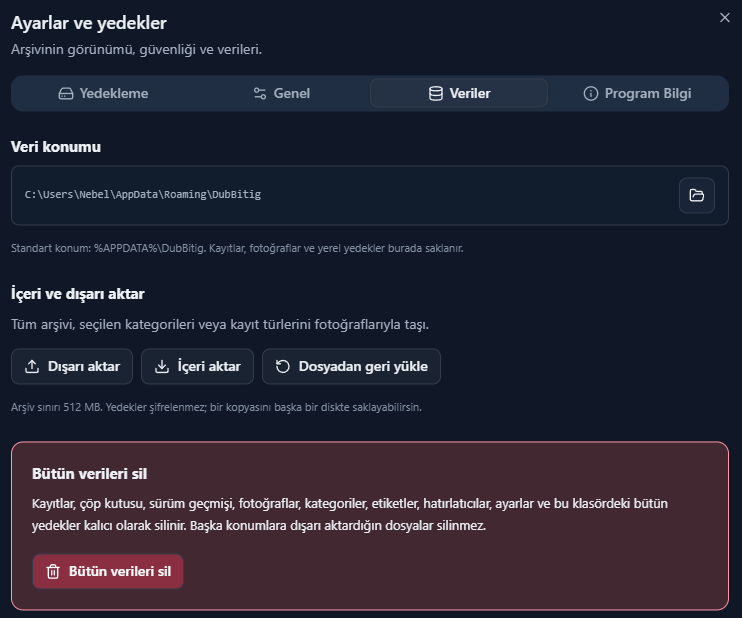

# DubBitig 1.6

Komut, program, bağlantı, Markdown notu ve fotoğraflar için Türkçe kişisel arşiv. DubBitig adı Sümerce Dub (Tablet) + Eski Türkçe Bitig (Yazı) birleşimidir.

**[Windows Setup indir](https://github.com/Nergal-exe/DubBitig/releases/latest)** · [Tüm sürümler ve Chrome eklentisi](https://github.com/Nergal-exe/DubBitig/releases) · [Hata bildir](https://github.com/Nergal-exe/DubBitig/issues)

**Lisans:** [GNU General Public License v3.0 (GPLv3)](LICENSE.txt)

## Ekran görüntüleri

### Ana ekran

Kayıt türleri, arama, sıralama ve kategori/etiket yönetimine erişim sunan koyu temalı arşiv ekranı.



### Yeni kayıt ve Markdown düzenleyici

Komut, program, bağlantı, not veya fotoğraf kaydı oluşturma; Markdown biçimlendirme ve önizleme seçenekleri.



### Yedekleme

Otomatik yedekleme aralığını seçme, elle yedek alma ve mevcut yedekleri geri yükleme.



### Genel ayarlar

Bağlantı denetimi, bildirim testi ve sistem tepsisinde çalışma hakkında bilgiler.



### Veri yönetimi

Veri klasörüne erişim, içeri/dışarı aktarma, dosyadan geri yükleme ve bütün verileri silme seçenekleri.



## Kurulum ve veri konumu

`release-dubbitig/DubBitig-1.6.0-Setup.exe` dosyasını çalıştırın. Kurulum yönetici izni ister; varsayılan uygulama konumu `C:\Program Files\DubBitig` olur. Eski sürümü kurulumdan önce kapatın. Setup önceki kullanıcı kurulumunu yükseltir; arşivi silmez. `DubBitig-Baslat.cmd` önce Program Files içindeki sürümü açar.

Veriler kullanıcıya özel `%APPDATA%\DubBitig` klasöründedir. Önceki `%APPDATA%\sakli` arşivi ilk açılışta fotoğrafları, ayarları ve yedekleriyle taşınır. Yeni konumda arşiv varsa üzerine yazılmaz. Chrome önceden yeni gelen kutusu oluşturduysa aşamalı taşıma yapılır; kesilen işlem sonraki açılışta tamamlanır. Çakışmada veriler korunarak hata gösterilir.

- `sakli.sqlite`: kayıtlar, kategoriler, etiketler, geçmiş ve ayarlar. Eski yedek uyumluluğu için veritabanı ve `.sakli` uzantısı korunur.
- `photos/`: yerel fotoğraflar ve web önizlemeleri.
- `backups/`: tam arşiv yedekleri.
- `capture-inbox/`: Chrome aktarım istekleri ve makbuzları.

Ayarlar → Veriler bölümünde gerçek konumu görebilir ve klasörü açabilirsiniz. Uygulamayı kaldırmak arşivi silmez.

## Kullanım

- Yeni kayıt: **Ctrl+N**. Arama: **Ctrl+K**. Başlık, içerik, açıklama, bağlantı, kategori, etiket ve fotoğraf adı aranır; OCR yoktur.
- Notlarda Markdown başlıkları, kalın/italik, listeler, tablolar, bağlantılar ve kod blokları kullanılır. Düzenle / Önizleme sekmeleri bulunur. HTML çalıştırılmaz; harici Markdown görselleri otomatik indirilmez, fotoğraf olarak eklenebilir.
- Komutlarda otomatik veya seçili dilde sözdizimi vurgulaması vardır. PowerShell, Bash, CMD, JavaScript, TypeScript, Python, JSON, SQL, YAML, HTML/XML, CSS ve C# desteklenir. Komutlar çalıştırılmaz; özgün metin tek tıkla kopyalanır.
- Kategoriler yalnızca **Kategorileri yönet** içinde listelenir. Kayıtları göster düğmesi o kategoriyi filtreler. Kategori/etiket kaldırmak kayıtları silmez.
- Açık/koyu tema sol alttan seçilir. Arayüz React, Tailwind CSS ve shadcn/ui bileşenleri kullanır.
- Saatin yanındaki simge: aç, pencereyi gizle, panodakini kaydet, çıkış. Gizlenen pencerenin hatırlatıcıları çalışmaya devam eder. Pencerenin X düğmesi uygulamayı kapatmaz, sistem tepsisine gizler. Tamamen kapatmak için simgeye sağ tıklayıp Çıkış seçin. Uygulamayı yeniden açmak mevcut pencereyi gösterir. Windows açılışında otomatik başlatma etkin değildir.
- **Program Bilgi** sekmesinde uygulamanın amacı, özellikleri ve adının anlamı bulunur.
- PNG/JPEG/WebP/GIF desteklenir; fotoğraf başına 20 MB, kayıt başına 30 fotoğraf sınırı vardır.

## Yedekleme ve silme

Ayarlar → Yedekleme: 30 dakika, günlük, haftalık veya aylık aralık seçilebilir. Değişiklik varsa yedek alınır; uygulama kapalıyken kaçırılan kontrol sonraki açılışta yapılır. Son 14 otomatik yedek tutulur; elle alınanlar korunur.

Dışa aktarmada Tümünü dışa aktar, Kategorileri dışa aktar ve Kayıt türlerini dışa aktar seçenekleri vardır. Tek bir kategori/tür seçerek ayrı dosyaya, birden fazla seçerek tek dosyaya aktarabilirsiniz. Kayıt türleri: komut, program, bağlantı, not, fotoğraf. Kategori/tür aktarımları yalnızca aktif kayıtları ve bunlara ait fotoğrafları/geçmişi içerir. İçeri aktarma bu dosyaları özgün kategori ve türlerini koruyarak birleştirir. İstenirse Hedef kategoriye yeni kopyalar ekle kullanılabilir. Tam arşiv çöp kutusu ve geçmişi de içerir. Tek kategoriye içe aktarma yeni kopyalar oluşturur. Kategori veya kayıt türü dosyası bütün arşivin yerine geri yüklenemez. Tam geri yükleme önce güvenlik yedeği alır. `.sakli` ZIP arşiv sınırı 512 MB; yedekler şifrelenmez. Başka diske kopyalamak disk arızasına karşı koruma sağlar.

**Ayarlar → Veriler → Bütün verileri sil**, `BÜTÜN VERİLERİ SİL` yazılı onayıyla kayıtları, çöp kutusunu, geçmişi, kategorileri, etiketleri, hatırlatıcıları, fotoğrafları, ayarları ve veri klasöründeki yerel yedekleri kalıcı olarak temizler. Veritabanı boş sayfalardaki eski içeriği bırakmadan yeniden oluşturulur. Başka konuma dışarı aktarılan dosyalar ve kaynak fotoğraflar silinmez. Silme sırasında devam eden web önizlemeleri arşivi yeniden dolduramaz.

## Bağlantılar, geçmiş ve hatırlatıcılar

HTTP/HTTPS bağlantılarında başlık, açıklama, favicon ve varsa önizleme alınır. Oturum/JavaScript gerektiren veya erişimi engelleyen sitelerde elle bilgi girilebilir. Günlük arka plan denetimi 404/410 yanıtlarını kırık, zaman aşımı/403/5xx yanıtlarını belirsiz gösterir. Denetim Genel sekmesinden kapatılabilir.

Not/komutların son 50 içerik sürümü saklanır. Geçmişi geri yüklemek güncel içeriği de geçmişe kaydeder. Tarihli hatırlatıcılar bir kez/günlük/haftalık/aylık çalışır. Son kullanma tarihi kayıt silmez; bildirim üretir. Uygulama kapalıyken kaçırılan bildirimler sonraki açılışta gösterilir ve Hatırlatıcılar bölümünde saklanır.

## Windows ve Chrome

Setup Windows masaüstü/Dosya Gezgini sağ tık menülerini ve Chrome native-messaging bağlantısını kurar. Windows 11'de Daha fazla seçenek altında görünebilir. Başka uygulamalarda kopyaladıktan sonra **Ctrl+Alt+D** ile kaydedin. Dosyalar üzerindeki menü metin/komut içeriğini, fotoğrafları veya diğer dosyaların konumunu alır; çalıştırmaz.

Chrome eklentisi henüz Chrome Web Store'da yayımlanmamıştır. İlk kurulumda uygulamadaki Windows ve Chrome bölümünden eklenti klasörünü açın; `chrome://extensions` → Geliştirici modu → Paketlenmemiş öğe yükle ile ekleyin. Kaynak klasörden yüklediyseniz yeni sürüm için Yeniden yükle düğmesine basın. Seçili metin veya bağlantı sağ tıkla kaydedilebilir; uygulama kapalıysa açılır. Ayrıntılar `chrome-extension/README.md` içindedir. Mağaza yayını sonrası aynı public key/ID ile `DUBBITIG_CHROME_STORE_ID` derleme değişkeni kullanılabilir. Chrome kullanıcı onayı isteyebilir.

## Geliştirme ve doğrulama

```powershell
npm.cmd install
npm.cmd run build
npm.cmd start
npm.cmd test
npm.cmd run test:desktop
npm.cmd run test:features
npm.cmd run test:tray-transfer
npm.cmd run dist
npm.cmd run test:capture
```

`test:capture` için paketlenmiş `release-dubbitig/win-unpacked` gerekir. `SAKLI_TEST_EXE` ile masaüstü/özellik testleri paketlenmiş EXE'ye yönlendirilir. `tests/chrome-test.ps1` ayrı Chrome profiliyle gerçek eklenti aktarımını sınar. Testler gerçek kullanıcı arşivi yerine geçici klasörler kullanır. Derleme için Node.js ve Windows .NET Framework C# derleyicisi gerekir. Geliştirme arayüzü `npm run dev`, Electron için `SAKLI_DEV=1` ile açılabilir.

## Mimari

`src/shared/model.ts` doğrulama şemaları ile ArchivePort, AssetPort, BackupPort ve SyncTransport sözleşmelerini içerir. `electron/repository.ts` SQLite adapterıdır; `electron/service.ts` Electron'dan bağımsız iş kurallarını uygular. `electron/data-location.ts` veri geçişini yönetir. `electron/main.ts` dar kapsamlı IPC, tepsi, pano ve dosya diyaloglarını sağlar; `src/api.ts` arayüzün adapter erişim noktasıdır.

Renderer sandbox, contextIsolation ve nodeIntegration=false kullanır. Harici adresler HTTP/HTTPS olarak sistem tarayıcısında açılır. Web isteklerinde boyut/zaman/yönlendirme ve özel ağ adresi kontrolleri bulunur. Telemetri yoktur. Mevcut sürüm yereldir; çalışan self-hosted/web senkronizasyonu yoktur. Sonraki adım kimlik doğrulamalı HTTP adapterları, kalıcı outbox, cihaz kimliği ve çakışma yönetimidir.

Windows paketinde kod imzası bulunmaz; dağıtım imzası ayrıca yapılandırılabilir.

## Lisans

DubBitig, **GNU General Public License v3.0 (GPLv3)** lisansı altında sunulur. Lisansın tam metnine [LICENSE.txt](LICENSE.txt) dosyasından ulaşabilirsiniz.
